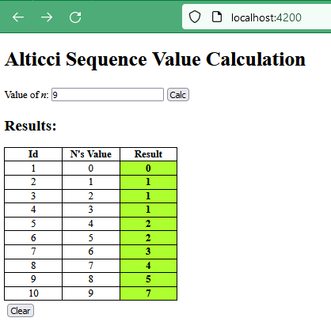

# alticci-sequece-value-calc

This project is a front end, implemented using Angular 15, that consumers [Alticci Sequence Value Calc REST API](https://github.com/alticci-sequence-value-calc/Alticci-Sequence-Value-Calc-back-end).

## Running the application

### Using docker

Prerequisite:

Two ways to run this project using Docker: 1st) Creating your local docker image; and 2nd) Run one existent from [Docker Hub](https://hub.docker.com/repository/docker/flauberjp/alticci-sequence-value-calc-front-end/general).

1st way)

Before building the container image run it in dev mode (check instructions more below).

Then, build the image with:

> docker build -t flauberjp/alticci-sequence-value-calc-front-end .

2nd way)

Pull the image available from Docker Hub:

> docker pull flauberjp/alticci-sequence-value-calc-front-end:latest

With the image, then run the container using:

> docker run -i --rm -p 4200:80 flauberjp/alticci-sequence-value-calc-front-end

You can navigate to `http://localhost:4200/`.

### In dev mode

Prerequisite:

- Node.js (16.13 or higher) installed.
- [Angular CLI](https://github.com/angular/angular-cli) version 15.2.4 installed.

Clone this repository, then on the root directory of this project, run `npm install`, then run `ng serve` for a dev server, and finally navigate to `http://localhost:4200/`.

Below an evidence of what you will see:

